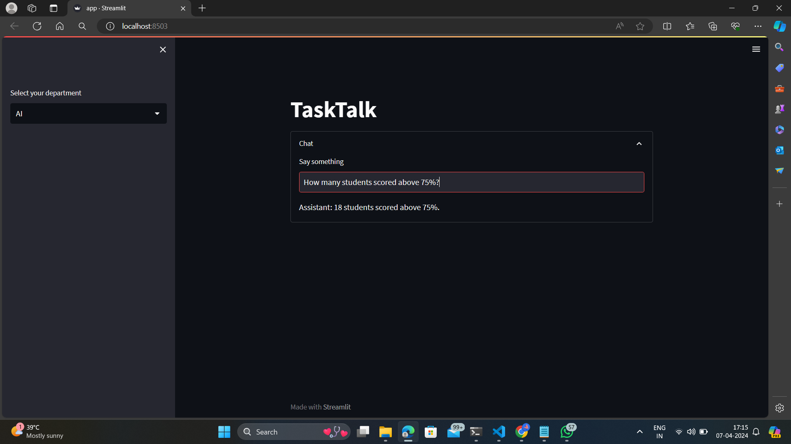
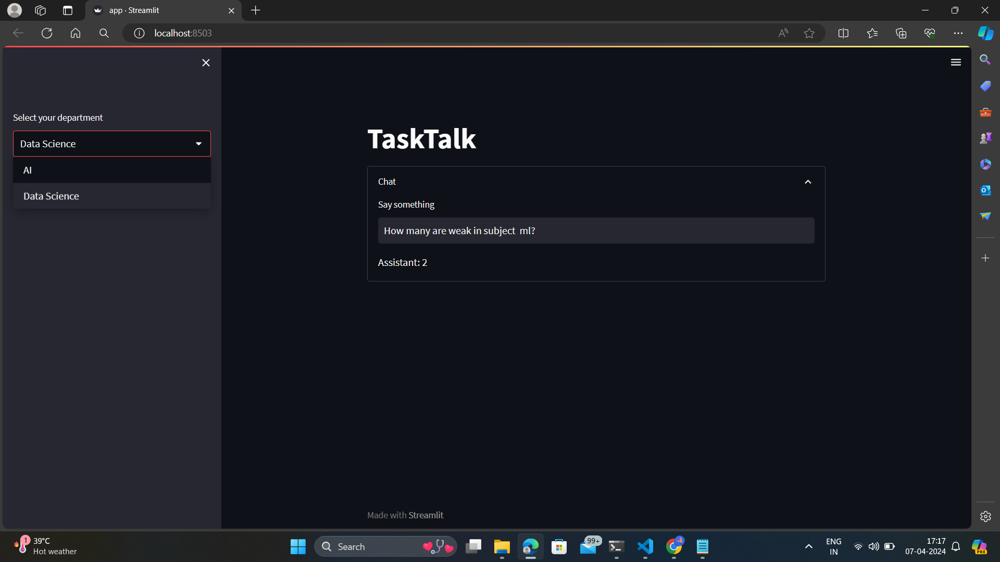
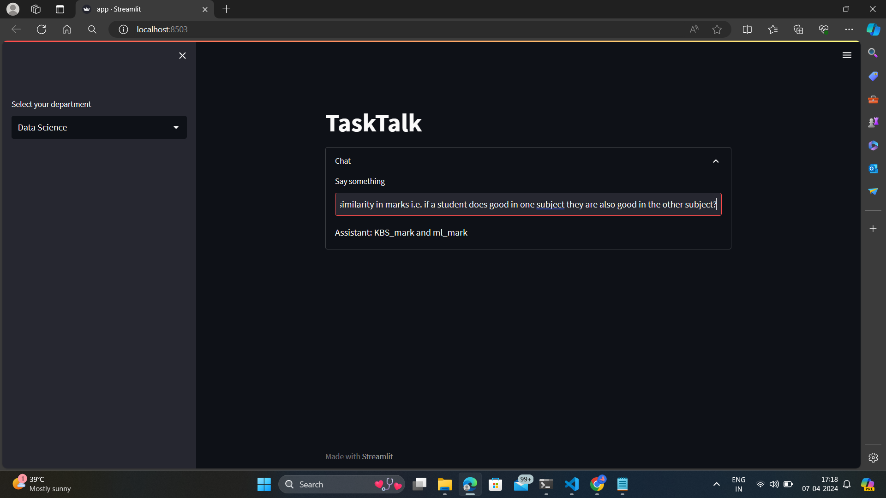

# TaskTalk
"TaskTalk" is a conversational AI chatbot for faculty members in AI and Data Science departments, allowing them to query and analyze student exam data separately while ensuring data segregation. It integrates with Streamlit for an intuitive interface.

## Installation

To run this application locally, follow these steps:

1. Clone this repository to your local machine.
2. Navigate to the project directory.
3. Install the required dependencies by running `pip install -r requirements.txt`.

## Usage

1. Run the application by executing `streamlit run app.py` in your terminal.
2. Once the application is running, a web browser window will open automatically.
3. Select your department from the dropdown menu provided (either "AI" or "Data Science").
4. Type your message in the text input box.
5. Press Enter or click outside the input box to submit your message.
6. The AI assistant will respond to your message, and the conversation will be displayed in the sidebar.

## Files and Structure

- **app.py**: This is the main Python script containing the Streamlit application code.
- **requirements.txt**: This file lists all the Python dependencies required to run the application.
- **AI1.db** and **DS1.db**: These are SQLite database files corresponding to the "AI" and "Data Science" departments, respectively.
- **langchain/**: This directory contains modules for language chain processing and database interaction.
- **langchain_openai.py**: This module initializes the OpenAI conversational AI model.
- **README.md**: This file provides instructions and information about the project.

## Configuration

- The OpenAI API key is set as an environment variable `OPENAI_API_KEY` within the script.
- The temperature parameter for the OpenAI model can be adjusted for controlling the randomness of the generated responses.

## Dependencies

- Streamlit: A Python library for creating interactive web applications.
- OpenAI: A powerful natural language processing platform.

## 📷 Screenshot

--- 

This project is created by Swetha Krithika.M
